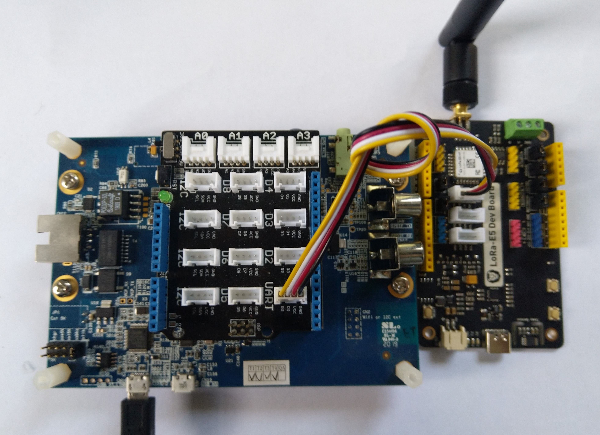

# SeeedLoRaE5LoRaWAN-NetNF
A C# library for [LoRaWAN](https://lora-alliance.org/about-lorawan) connectivity for [Seeedstudio](https://www.seeedstudio.com/) [LoRa-E5 Module](https://www.seeedstudio.com/LoRa-E5-Wireless-Module-p-4745.html) equipped [.NET nanoFramework](https://nanoframework.net/) powered devices.

The repo has the source code for the series of blog posts written as I built this library

01. [Basic connectivity](http://blog.devmobile.co.nz/2021/05/24/nanoframework-seeed-lora-e5-lorawan-library-part1//)
02. [Nasty OTAA connect](http://blog.devmobile.co.nz/2021/05/25/nanoframework-seeed-lora-e5-lorawan-library-part2/)
03. [Seeedstudio LoRa E5 Wakeup](http://blog.devmobile.co.nz/2021/05/31/seeed-lora-e5-wakeup/)
04. [nanoFramework Seeed LoRa-E5 on Github](https://blog.devmobile.co.nz/2021/06/12/nanoframework-seeed-lora-e5-on-github/)
05. [Seeed LoRa-E5 Wakeup](https://blog.devmobile.co.nz/2021/05/31/seeed-lora-e5-wakeup/)
06. [Seeed LoRa-E5 LowPower problem](http://blog.devmobile.co.nz/2021/07/07/seeed-lora-e5-lowpower-problem/)

